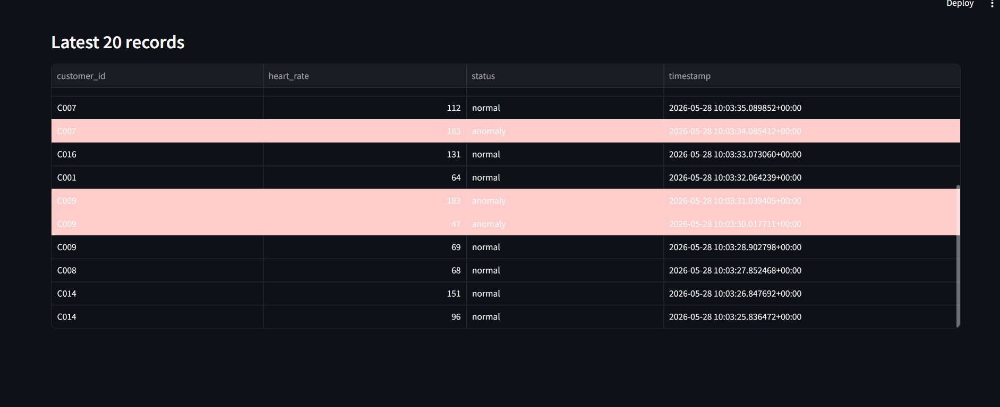
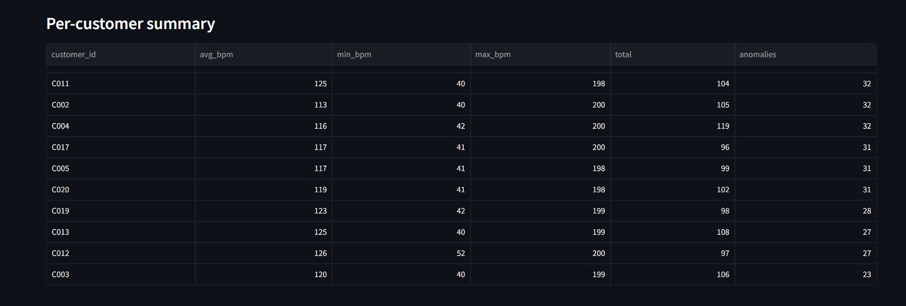

# Real-Time Customer Heart Beat Monitoring System

A real-time data pipeline that simulates, streams, processes, and visualizes customer heart rate data using Apache Kafka, PostgreSQL, and Streamlit.

---

## Architecture


| Stage | Component | Description |
|-------|-----------|-------------|
| 1. Generate | Data Generator | Simulates heart rate readings for 20 fake customers |
| 2. Produce | Kafka Producer | Streams readings to the `heartbeats` topic every second |
| 3. Stream | Kafka Topic | Buffers messages in real time (KRaft, no ZooKeeper) |
| 4. Consume | Kafka Consumer | Validates data, detects anomalies, writes to PostgreSQL |
| 5. Store | PostgreSQL | Stores all heartbeat records with timestamp indexing |
| 6. Visualise | Streamlit Dashboard | Displays live metrics, charts, and anomaly alerts |

---

## Project Structure

```
Real-Time-Customer-Heart-Beat-Monitoring-System/
├── producer/
│   ├── generator.py       # Synthetic heart rate data generator
│   └── producer.py        # Kafka producer
├── consumer/
│   └── consumer.py        # Kafka consumer + anomaly detection + DB writer
├── dashboard/
│   └── app.py             # Streamlit live dashboard
├── sql/
│   └── schema.sql         # PostgreSQL table and index definitions
├── docker-compose.yml     # Kafka (KRaft) + PostgreSQL services
└── README.md
```

---

## Prerequisites

- Windows with WSL2 (Ubuntu)
- Docker + Docker Compose
- Python 3.8+
- Python packages: `kafka-python-ng`, `psycopg2-binary`, `faker`, `streamlit`, `pandas`

---

## Setup & Installation

### 1. Clone the repository

```bash
git clone https://github.com/Odile-nza/Real-Time-Customer-Heart-Beat-Monitoring-System.git
cd Real-Time-Customer-Heart-Beat-Monitoring-System
```

### 2. Create and activate a virtual environment

```bash
python3 -m venv ogenv
source ogenv/bin/activate
```

### 3. Install dependencies

```bash
pip install kafka-python-ng psycopg2-binary faker streamlit pandas
```

### 4. Start Kafka and PostgreSQL

```bash
sudo service docker start
docker compose up -d
docker compose ps   # both services should show "healthy"
```

> PostgreSQL runs on port `5434` (5432 was occupied).

### 5. Apply the database schema

```bash
docker exec -it postgres psql -U admin -d heartbeat_db
```

Inside the Postgres shell:

```sql
CREATE TABLE IF NOT EXISTS heartbeats (
    id          SERIAL PRIMARY KEY,
    customer_id VARCHAR(10) NOT NULL,
    name        VARCHAR(100),
    heart_rate  INTEGER NOT NULL,
    status      VARCHAR(10) NOT NULL,
    timestamp   TIMESTAMPTZ NOT NULL,
    created_at  TIMESTAMPTZ DEFAULT NOW()
);

CREATE INDEX IF NOT EXISTS idx_heartbeats_timestamp ON heartbeats (timestamp DESC);
CREATE INDEX IF NOT EXISTS idx_heartbeats_customer ON heartbeats (customer_id);

\q
```

---

## Running the Pipeline

Open **three separate terminals** (all in WSL with the virtual environment activated).

### Terminal 1 — Start the producer

```bash
cd producer
python producer.py
```

### Terminal 2 — Start the consumer

```bash
cd consumer
python consumer.py
```

### Terminal 3 — Start the dashboard

```bash
cd dashboard
streamlit run app.py
```

Open your browser at the Network URL shown in the terminal (e.g. `http://172.28.x.x:8501`).

---

## Data Fields

| Field | Description |
|-------|-------------|
| `customer_id` | Unique customer identifier (C001–C020) |
| `timestamp` | UTC timestamp of the reading |
| `heart_rate` | Heart rate in beats per minute (bpm) |
| `name` | Fake customer name (generated) |
| `status` | `normal` or `anomaly` |

### Anomaly thresholds

| Status | Condition |
|--------|-----------|
| `normal` | 50 ≤ heart_rate ≤ 160 bpm |
| `anomaly` | heart_rate < 50 or heart_rate > 160 bpm |

---

## Dashboard Features

- Live metrics — total records, normal count, anomaly count, latest BPM
- Heart rate over time — line chart updating every 3 seconds
- Anomalies per customer — bar chart
- Per-customer summary — avg, min, max BPM and anomaly count
- Latest 20 records — anomalies highlighted in red

---

## Database Credentials

| Setting | Value |
|---------|-------|
| Host | `localhost` |
| Port | `5434` |
| Database | `heartbeat_db` |
| User | `admin` |
| Password | `admin123` |

---

## Technologies Used

- **Apache Kafka 3.7** (KRaft mode — no ZooKeeper)
- **PostgreSQL 16**
- **Python 3.8+**
- **kafka-python-ng** — Kafka client
- **psycopg2** — PostgreSQL client
- **Faker** — synthetic data generation
- **Streamlit** — live dashboard
- **Docker Compose** — local infrastructure

---

## Screenshots

| View | Preview |
|------|---------|
| Heart rate over time |  |
| Patient detail |  |
| Records table |  |
| Summary stats |  |

---

## Author

**Odile** — Data Engineering Specialization, AmaliTech